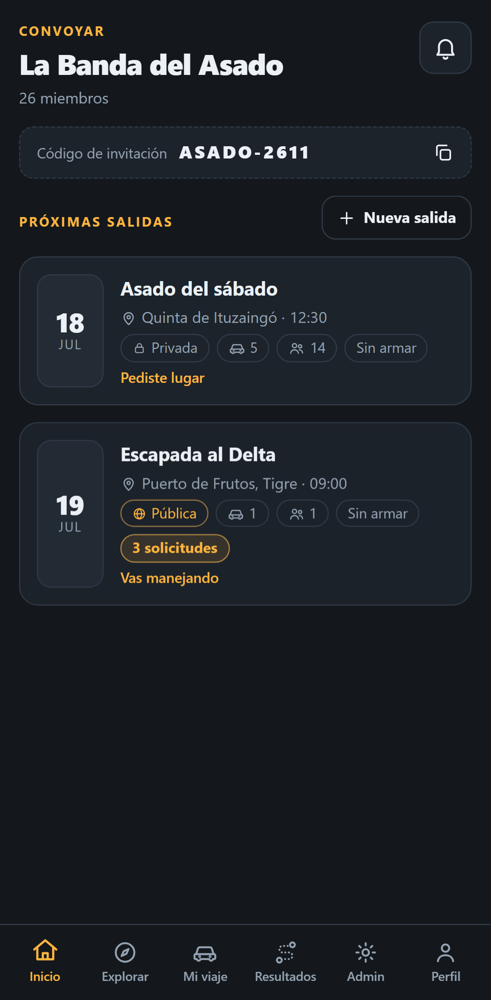
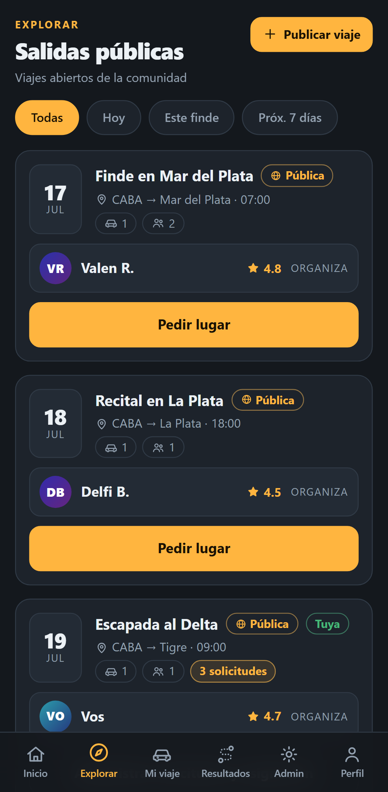
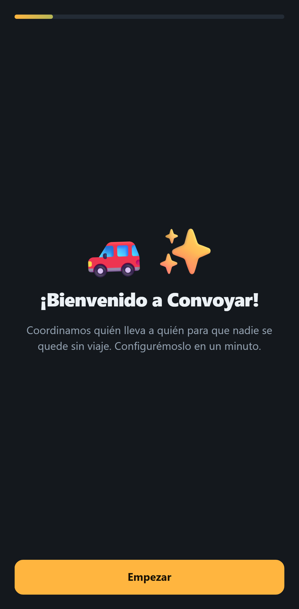
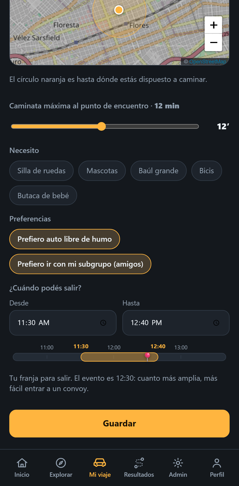
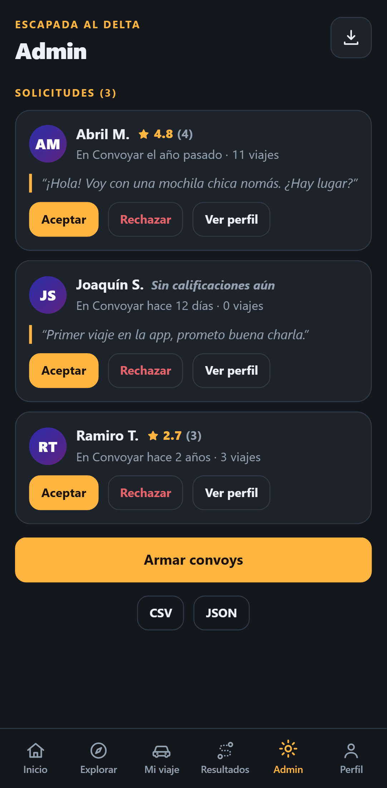
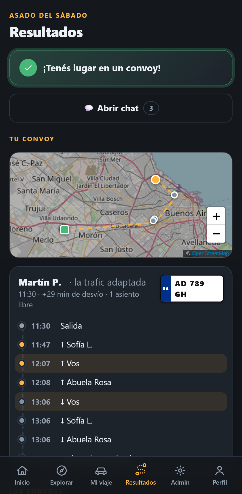
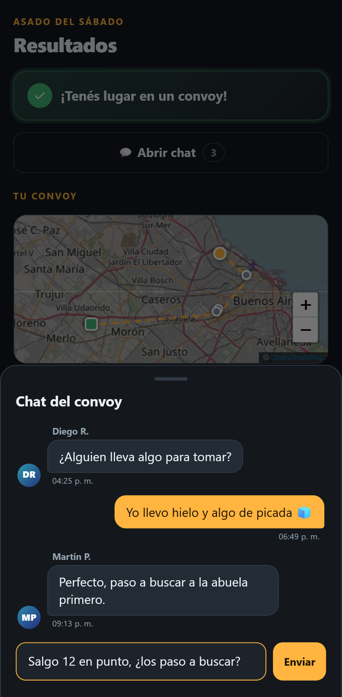
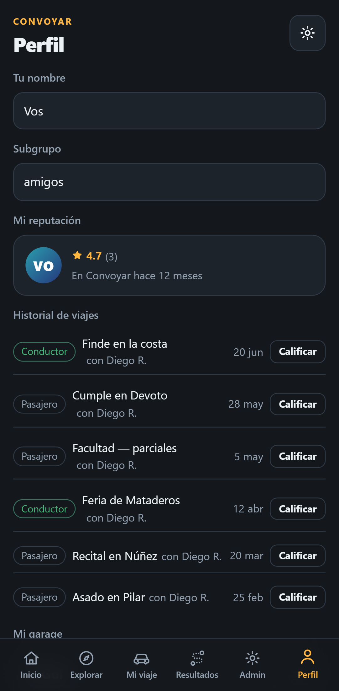

# Convoyar 🚗

**Logística colaborativa para organizaciones**: coordina quién lleva a quién en asados, oficinas, comunidades y eventos de 10 a 90+ personas. Matching óptimo con restricciones reales, mapas OpenStreetMap y cero APIs pagas. Y además, **viajes públicos tipo BlaBlaCar**: salidas abiertas donde la gente pide lugar y el organizador acepta o rechaza mirando reputación ★, historial y antigüedad.

Demo de fábrica incluida: *La Banda del Asado* (26 personas, 8 autos, 5 puntos de encuentro en CABA) con el "Asado del sábado" listo para calcular, más la *Comunidad Convoyar* con viajes públicos a Mar del Plata y La Plata, y 3 solicitudes esperando tu decisión en la "Escapada al Delta".

| Inicio | Explorar | Onboarding | Mi viaje |
|---|---|---|---|
|  |  |  |  |

| Solicitudes | Resultados + confetti | Chat del convoy | Perfil |
|---|---|---|---|
|  |  |  |  |

> 🤖 **¿Sos un agente de IA?** Empezá por [AGENTS.md](AGENTS.md). Diseño en [docs/ARCHITECTURE.md](docs/ARCHITECTURE.md), estado vivo en [docs/TODO.md](docs/TODO.md), qué falta para escalar en [docs/GROWTH.md](docs/GROWTH.md).
>
> 🚀 **Estado de lanzamiento:** el backend real ya está **conectado** (Supabase: alta/login con **email + contraseña**, orgs, realtime, RLS activo, migraciones corridas en dev y prod). Falta el *flip* de producción a `convoyar.com` (hoy corre un preview live) y publicar en las tiendas. Guía operativa paso a paso en [docs/lanzamiento/](docs/lanzamiento/); migraciones SQL en [server/](server/).

---

## Correr en 3 comandos

```bash
npm install
npm run dev        # abre http://localhost:5173
npm test           # unit + integración (motor · público · i18n · auth · garage · smoke)
```

Otros comandos:

```bash
npm run test:e2e      # 22 flujos E2E con Playwright (levanta su server en :5199)
npm run typecheck     # tsc --noEmit
npm run build         # → dist/         (deploy web / PWA / Capacitor)
npm run build:single  # → dist-single/  (UN solo index.html autocontenido)
npm run preview       # sirve dist/ localmente
```

---

## Qué hace

- **Onboarding guiado**: wizard de bienvenida (idioma → nombre → email → tu casa → ¿auto? → notificaciones) para que un usuario nuevo entienda todo en un minuto.
- **Roles por evento**: cada miembro elige conductor / pasajero / no voy, con ventana horaria.
- **Garage**: cargá varios vehículos (con alias tipo "el Gol"/"la moto") y elegí **con cuál llevás en cada salida** — el motor toma la capacidad del vehículo elegido.
- **Restricciones duras** (nunca se violan): capacidad del auto, desvío máximo del conductor, radio de caminata del pasajero, ventanas horarias, necesidades (♿ silla de ruedas, 🐕 mascotas, 👶 sillita).
- **Configurable en el espacio Y el tiempo**: el **radio de caminata** se dibuja en vivo como un círculo en el mapa; la **ventana horaria** como un timeline con la hora del evento marcada. Ambos se mueven con sliders.
- **Preferencias blandas** (solo desempatan, jamás descartan): mismo subgrupo, auto libre de humo.
- **Puntos de encuentro**: si al pasajero le conviene caminar a una parada conocida (estación, plaza), el motor lo propone con minutos de caminata.
- **Salidas públicas o privadas (tipo BlaBlaCar)**: un evento privado es solo de la org; uno público aparece en **Explorar** (con filtros por fecha: hoy / este finde / próximos 7 días) para toda la comunidad. Pedís lugar con un tap; el organizador ve tu **puntuación ★, cuántos viajes hiciste, hace cuánto te uniste, tus reseñas y tu mensaje**, y te acepta o rechaza. Al aceptarte, entrás al cálculo automáticamente.
- **Reputación y logros**: reseñas de 1–5 estrellas, historial, perfil público con antigüedad, **insignias** (primer viaje, cinco estrellas, garage…) y barra de "completá tu perfil".
- **Aporte de nafta sugerido** (informativo, sin cobros): estima cuánto acercarle al conductor, para arreglar entre las personas.
- **Simple por fuera, potente por dentro**: lo core siempre visible; la configuración avanzada (cuenta, idioma, tema, formato de hora, preferencias de viaje por defecto, aporte de nafta) vive en **Ajustes**, a un tap.
- **Cuentas reales**: alta e inicio de sesión con **email + contraseña** (Supabase Auth) y recuperación de contraseña. Cada usuario nuevo arranca con su **org personal** ("Mis viajes"); en modo demo local (sin backend) la app abre directo con la org de fábrica, sin login.
- **Grupos privados**: ilimitados y gratis. Se comparte un **código de invitación**; el modelo de backend soporta además invitar por **email** y por **link con toggle** (estilo Drive, apagado por defecto).
- **Comunicaciones**: **chat por convoy** entre participantes y preferencias de aviso por tipo (asignaciones / solicitudes / chat / email).
- **Moderación**: **reportar** (pausa a la persona reportada hasta que un humano revise) y **bloquear** (personal: dejás de ver a quien bloqueás). Sin verificación de identidad por ahora.
- **Admin**: armar/rearmar convoys, mover pasajeros a mano (con aviso si rompe una restricción), aceptar/rechazar solicitudes, cancelar conductor (recálculo incremental con `warmStart`), métricas (asignados, autos, desvío, CO₂) y export CSV/JSON.
- **Celebraciones tipo Duolingo**: confetti al conseguir convoy y al armarlos, micro-interacciones, empty states ilustrados.
- **6 idiomas** (🇦🇷 es · 🇺🇸 en · 🇧🇷 pt · 🇩🇪 de · 🇮🇹 it · 🇫🇷 fr), modo oscuro/claro, mobile-first.

## Qué es real y qué es mock

| Área | Estado |
|---|---|
| Motor de matching (CVRPTW a pequeña escala) | **Real.** Módulo independiente en `src/engine/`, sin dependencias de UI. 90 pax + 20 autos en <1 s. |
| Backend / multi-dispositivo | **Real y conectado (Supabase).** Cliente en `src/services/supabaseClient.ts`; lectura/escritura y realtime en `src/services/repo.ts`. El interruptor `hasSupabase` prende el backend en dev/prod y lo apaga en tests, E2E y `build:single` (que siguen 100 % locales). |
| Auth | **Real: email + contraseña** (Supabase Auth), en `src/services/auth.ts` (alta, login, reset). En modo demo local no hay login: arranca con `meId "m0"`. |
| Modo público: solicitudes, aceptar/rechazar, reputación, historial | **Real** (lógica y UI completas). Con backend, las solicitudes entre personas reales sincronizan por **Realtime**. En modo demo local, el organizador ajeno "responde" solo a los ~4 s (`scheduleSimulatedReply` en `store.tsx`, **sólo activo si `!hasSupabase`**). |
| Ruteo | **Mock por defecto** (`MockRoutingProvider`: haversine ×1.3 a 26 km/h). Adaptador **OSRM real ya escrito** (`OsrmRoutingProvider`), swap de 1 línea (ver abajo). |
| Mapas | **Real**: Leaflet + tiles de OpenStreetMap (atribución incluida, obligatoria). |
| Chat del convoy | **Real** (UI + estado; con backend sincroniza por Realtime). La auto-respuesta simulada sólo corre en modo demo local. |
| Persistencia | Con backend: **Postgres en Supabase** (multi-dispositivo). En modo demo: localStorage (clave `convoyar:v4`) con fallback en memoria, un dispositivo. |
| Moderación (reportar / bloquear) | **Modelo en el backend** (`server/migrate-moderation.sql`: reportar pausa hasta revisión humana, bloquear es personal). Falta cablear la UI. Sin verificación de identidad por ahora. |
| Push notifications | **Pendiente.** Hoy: avisos in-app + Notification API del navegador (app abierta). Credenciales de Firebase listas; push nativo por hacer → [docs/lanzamiento/07](docs/lanzamiento/07-push-notifications.md). |
| Monetización | **Cableada y apagada** (100 % gratis, ver abajo). |

## Arquitectura

```
src/
  engine/       ← EL MOTOR. Cero imports de React/DOM. Portable a un worker o backend.
    types.ts      contrato: MatchInput → MatchResult (+ Violation[])
    matching.ts   solveMatching / validateMatch / applyManualMove (warmStart incremental)
    routing.ts    interfaz RoutingProvider + Mock + OSRM (una llamada matrix() por evento)
    geo.ts        haversine, caminata, RNG determinístico
  state/        store (context + useReducer), modelo v4, reputación, garage, logros, persistencia debounced
  screens/      Inicio · Explorar (público) · Mi viaje · Resultados · Admin · Perfil · Auth (login)
  components/   People (avatar/estrellas/perfil), MapPicker (Leaflet), RideCard, Chat, UI kit, íconos
  services/     supabaseClient (hasSupabase) · repo (AppState ⇄ Supabase + realtime) · auth (email+pass) · storage (cache local) · billing · notify · export
  i18n/         6 idiomas (es/en/pt/de/it/fr) con interpolación {var} y plurales (_one)
  seed.ts       demo determinística: org privada + comunidad pública (Buenos Aires)
server/         SQL ejecutable: schema · rls · migraciones (v3→v4, org personal, orgs, moderación) · edge-functions
e2e/            Playwright: flujos reales + generador de capturas
docs/           ARCHITECTURE.md · ROADMAP.md · TODO.md · GROWTH.md · lanzamiento/ · screenshots/
```

**Contrato del motor** (lo único que un backend futuro necesita respetar):
`solveMatching({ drivers, passengers, meetingPoints?, options? }, provider) → { rides, unassigned }`, donde cada `Ride` trae paradas ordenadas con ETA y desvío, y cada no-asignado trae un `UnassignedReason` legible (`capacidad`, `desvio`, `ventana`, `caminata`, `necesidades`, `sin_conductores`, `manual`).

## Ruteo real con OSRM (self-hosted, gratis)

1. Levantá OSRM con datos de tu región (ejemplo Argentina):

```bash
wget https://download.geofabrik.de/south-america/argentina-latest.osm.pbf
docker run -t -v $(pwd):/data ghcr.io/project-osrm/osrm-backend osrm-extract -p /opt/car.lua /data/argentina-latest.osm.pbf
docker run -t -v $(pwd):/data ghcr.io/project-osrm/osrm-backend osrm-partition /data/argentina-latest.osrm
docker run -t -v $(pwd):/data ghcr.io/project-osrm/osrm-backend osrm-customize /data/argentina-latest.osrm
docker run -t -i -p 5000:5000 -v $(pwd):/data ghcr.io/project-osrm/osrm-backend osrm-routed --algorithm mld /data/argentina-latest.osrm
```

2. Swap del provider en `src/state/store.tsx` (línea ~213):

```ts
// const provider = useMemo(() => new MockRoutingProvider(), []);
const provider = useMemo(() => new OsrmRoutingProvider("http://localhost:5000"), []);
```

El motor hace **una sola** llamada `matrix()` por cálculo (servicio `table` de OSRM), así que escala bien.

Geocoding futuro (buscar direcciones por texto): [Nominatim](https://nominatim.org/) self-hosted, mismo espíritu OSM. Hoy el origen se elige tocando el mapa, así que no hace falta.

## Deploy

**Web (estático):** `npm run build` y subí `dist/` a Netlify / Vercel / GitHub Pages / cualquier nginx. Es una PWA: manifest + service worker con cache de shell y de tiles (límite 250) → instalable y usable con conexión pobre.

**Un solo archivo:** `npm run build:single` genera `dist-single/index.html` autocontenido (~380 KB). Sirve para mandar por mail/Drive o demos. Solo necesita internet para los tiles del mapa.

**Android (Capacitor):** ya **scaffoldeado**. Capacitor 8 (`@capacitor/core|cli|android`) instalado, plataforma `android/` agregada y sincronizada con el build de producción, íconos/splash generados y firma de release preconfigurada por `android/keystore.properties`. Falta lo que sólo puede hacer el dueño: generar y respaldar la keystore, el `.aab` firmado y la cuenta de Google Play. Paso a paso en [docs/lanzamiento/05](docs/lanzamiento/05-google-play.md).

```bash
npm run build && npx cap sync android   # recompila la web (prod) y la copia al proyecto nativo
npx cap open android                     # Android Studio → firmar → .aab para Play Store
```

**iOS:** pendiente (requiere macOS/Xcode). `npx cap add ios` cuando toque → [docs/lanzamiento/06](docs/lanzamiento/06-app-store-ios.md).

Para push nativas: `@capacitor/push-notifications` + FCM/APNs, enganchando donde hoy está `services/notify.ts` → [docs/lanzamiento/07](docs/lanzamiento/07-push-notifications.md).

## Monetización (apagada por diseño)

Todo el rail está en `src/services/billing.ts`:

- Planes `free / pro / org` con límites (`maxOrgs`, `maxMembersPerOrg`, `metricsExport`) y gate `can(plan, feature)`. En Admin, exportar métricas con plan free muestra el upsell (podés probarlo hoy).
- `ADS_ENABLED = false` → el componente `AdSlot` no renderiza nada. Encendé el flag y decidí red (AdMob vía Capacitor en móvil, o el proveedor web que quieras).
- `purchase(plan)` es un stub con los puntos de integración anotados: **Stripe** (web) o **RevenueCat** (compras in-app multiplataforma).

Nada de esto afecta la funcionalidad actual: hoy es 100 % gratis y sin anuncios.

## Roadmap

1. **MVP local** ✅ — motor + UI completa + modo público tipo BlaBlaCar + onboarding + 6 idiomas + chat + deleite visual. Un dispositivo, ruteo mock con adaptador OSRM listo.
2. **Sync real (Supabase)** ✅ **conectado** — orgs, **auth email + contraseña**, realtime, org personal por usuario, solicitudes entre personas reales; migraciones corridas en dev+prod, RLS activo, el motor se mudó respetando el contrato. Falta: **flip de producción a `convoyar.com`** (hoy corre un preview live) y **push nativo**. Guía en [docs/lanzamiento/](docs/lanzamiento/).
3. **Tiendas y escala** — Android scaffoldeado (falta keystore + `.aab` + cuenta Play); iOS pendiente; push; luego OSRM propio, geocoding Nominatim, métricas históricas, confianza (moderación ya modelada en el backend; verificación de identidad más adelante).

Detalle técnico en [docs/ROADMAP.md](docs/ROADMAP.md) · qué falta para "nivel Silicon Valley" en [docs/GROWTH.md](docs/GROWTH.md) · cómo lanzar en [docs/lanzamiento/](docs/lanzamiento/).

## Decisiones que tomé distinto al spec (y por qué)

- **"Mover pasajero" con selector en vez de drag-and-drop**: en pantallas táctiles chicas el drag entre tarjetas largas es frustrante; un sheet con la lista de autos (capacidad visible) es más rápido y accesible. La lógica (`applyManualMove` + aviso de violaciones) es la misma.
- **Local-first primero, backend después (cumplido)**: el MVP arrancó 100 % cliente-side (gratis de operar, sin bloqueos), y el contrato del motor permitió **mudarse a Supabase sin tocar la UI** — que es exactamente lo que pasó. El modo local sigue vivo (interruptor `hasSupabase`) para tests, `build:single` y demos offline.
- **PWA primero, stores después**: mismo código; `dist/` ya es instalable como PWA y **Android ya está scaffoldeado** con Capacitor (falta la parte del dueño: keystore, `.aab`, cuenta Play).

## Licencia

MIT. Tiles © colaboradores de [OpenStreetMap](https://www.openstreetmap.org/copyright) (la atribución en el mapa no se quita).
